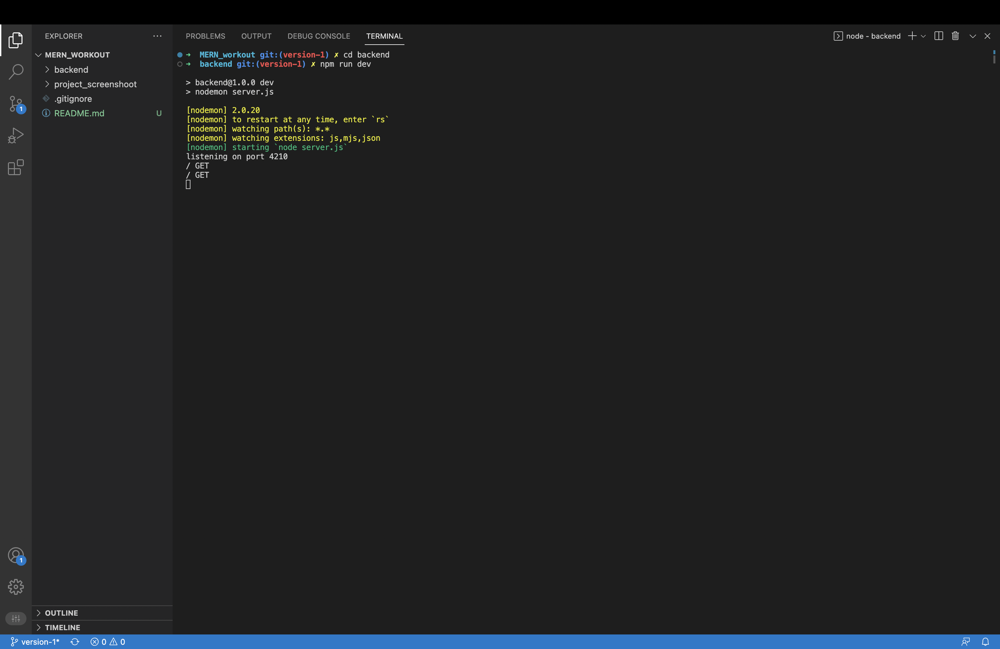
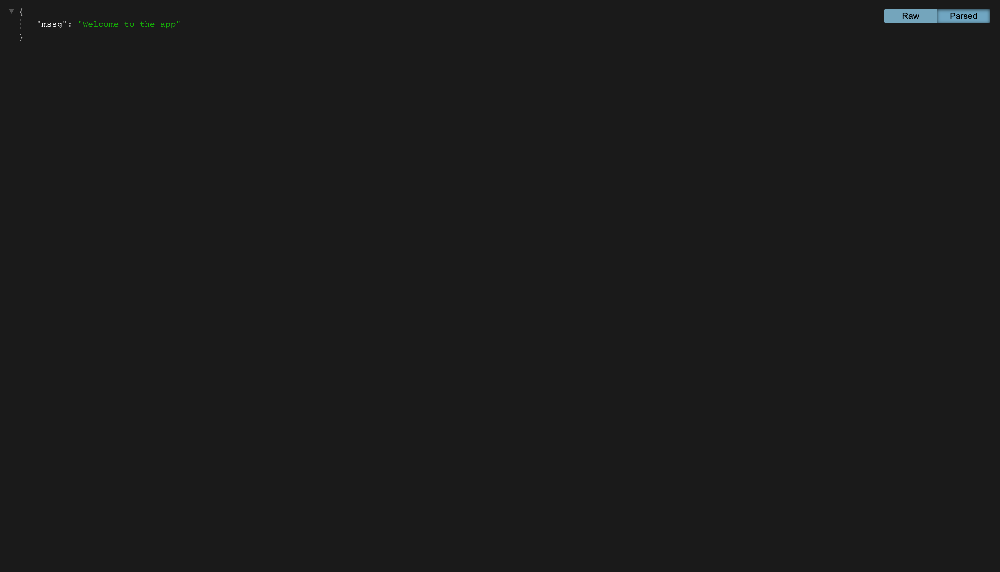
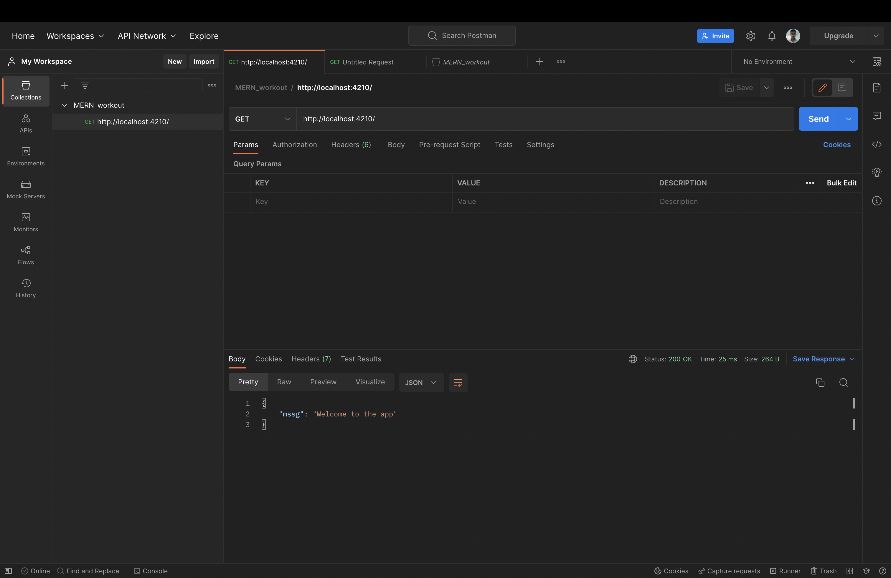

## `version-1`
## HOW TO RUN `MERN_workout` `App` ON YOUR LOCAL SERVER

Drive Folder Link: https://drive.google.com/drive/folders/12PaCTmmhgX1p1Go7VFYLcvcJnVbhT80F?usp=sharing

## TO RUN THE SERVER

IN THE PROJECT DIRECTORY/backend `(MERN_workout/backend)` 

### RUN :

### `(MERN_workout/backend)` : `npm run dev`

OPEN [http://localhost:4210/](http://localhost:4210/) TO VIEW `Home Page` IN YOUR BROWSER.

## VS_code

## Browser Output

## Postman

